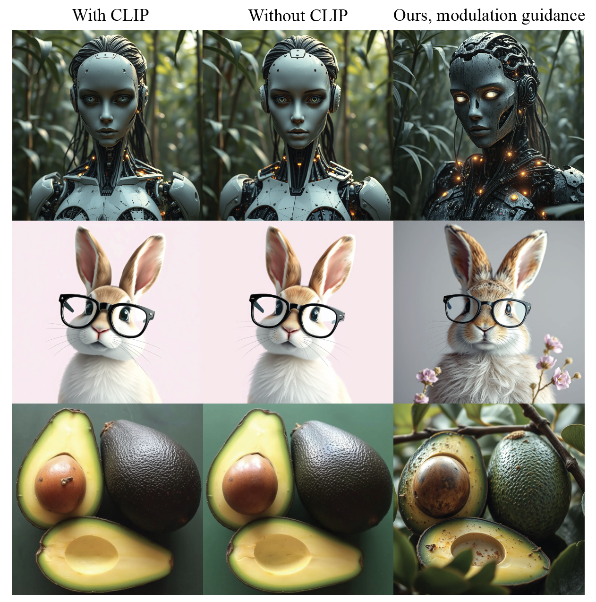
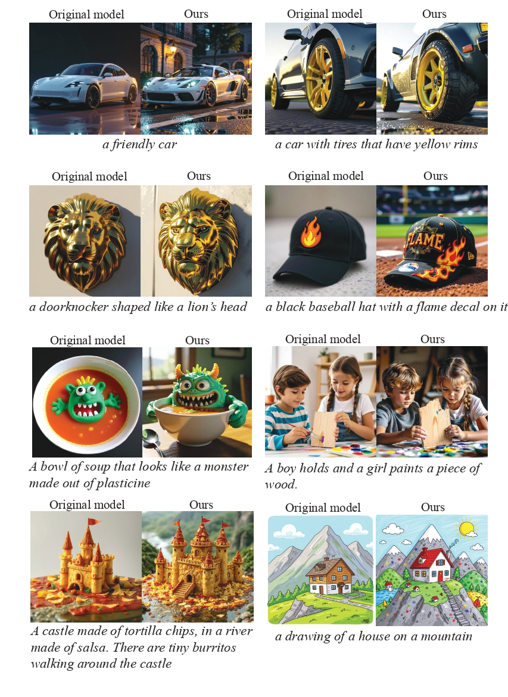
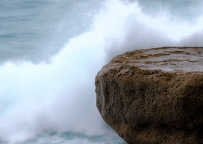
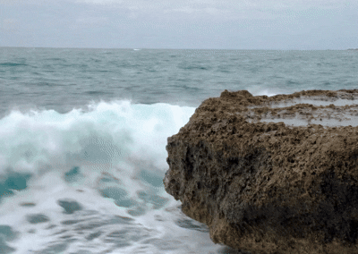
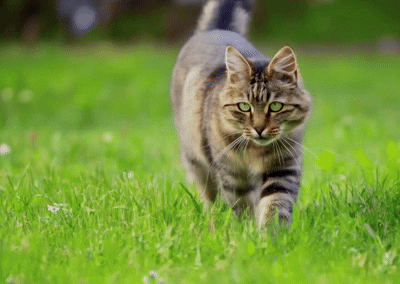
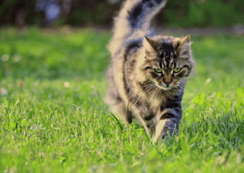
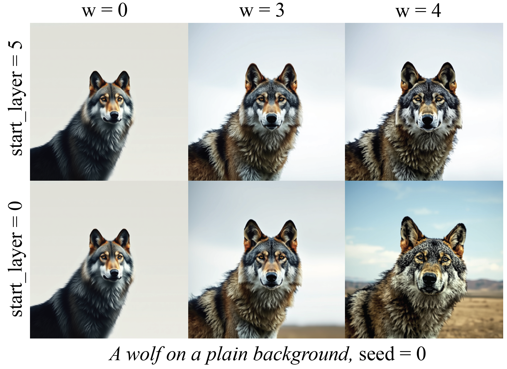
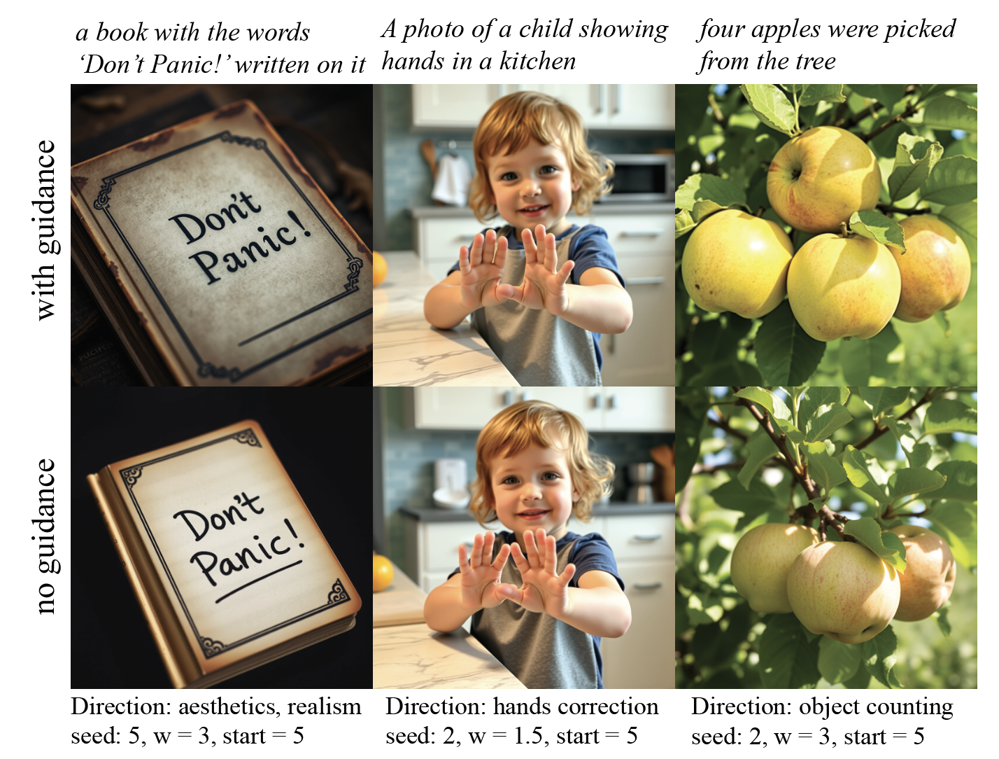
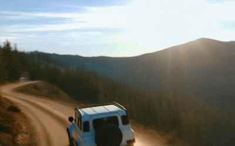
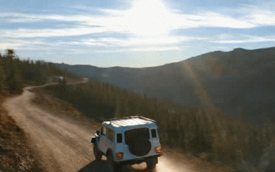

<h1 align="left">Rethinking Global Text Conditioning in <p>Diffusion Transformers</h1>

<p align="center">
  <a href="https://github.com/quickjkee">Nikita Starodubcev</a><sup>1✉</sup>,
  <a href="https://scholar.google.com/citations?user=UI10l34AAAAJ&hl=en">Daniil Pakhomov</a><sup>2</sup>,
  <a href="https://betterze.github.io/website/">Zongze Wu</a><sup>2</sup>, 
  <a href="https://github.com/free001style">Ilya Drobyshevskiy</a><sup>1</sup>,
</p>
<p align="center">
  <a href="https://scholar.google.com/citations?user=yYGI_XsAAAAJ&hl=en">Yuchen Liu</a><sup>2</sup>,
  <a href="https://scholar.google.com/citations?user=opL6CL8AAAAJ&hl=en">Zhonghao Wang</a><sup>2</sup>,
  <a href="https://scholar.google.ru/citations?user=QG2AkuYAAAAJ&hl=en">Yuqian Zhou</a><sup>2</sup>,
</p>
<p align="center">
  <a href="https://scholar.google.com/citations?user=R0bnqaAAAAAJ&hl=en">Zhe Lin</a><sup>2</sup>,
  <a href="https://scholar.google.com/citations?user=NiPmk8oAAAAJ&hl=en">Dmitry Baranchuk</a><sup>1</sup>
</p>

<p align="center">
  Yandex Research<sup>1</sup> &nbsp;&nbsp;&nbsp; Adobe Research<sup>2</sup><br>
  <small><sup>✉</sup> Corresponding Author</small>
</p>

<h2 align="left">TL;DR</h2>


<p align="left">

⚡ **CLIP pooled embeddings alone contribute little to generation quality in text-to-image and text-to-video diffusion models**  
We find that in state-of-the-art diffusion transformers text conditioning via modulation mechanism using pooled clip embeddings, CLIP($p$), provides little performance improvements.

⚡ **Using CLIP embeddings as guidance leads to significant gains**  
Instead of relying on basic CLIP($p$), we propose a guidance formulation: CLIP($p$) $+ w (\text{CLIP}(p^+) - \text{CLIP}(p^-))$,  where $p^+$ and $p^-$ denote positive and negative prompts, respectively.

⚡ **Simple, training-free, and broadly applicable**  
Our method requires no additional training, incurs negligible runtime overhead, and can be applied to various tasks.  It only involves selecting suitable $(p^+, p^-)$ and the guidance weight $w$.

</p>

<p align="center">

</p>


<h2 align="left">Gallery</h2>
<details>
<summary><b>More image examples. Click to expand</b></summary>

</details>

<details>
<summary><b>More video examples. Click to expand</b></summary>


<table align="center">
  <tr>
    <th>Original Model</th>
    <th>Ours</th>
  </tr>

  <tr>
    <td align="center">
      
    </td>
    <td align="center">
      
    </td>
  </tr>
  <tr>
    <td colspan="2" align="left">
      <b>Prompt:</b><br>
      <i>
      "A dynamic interaction between the ocean and a large rock. 
      The rock, with its rough texture and jagged edges, is partially submerged in the water, 
      suggesting it is a natural feature of the coastline. The water around the rock is in motion, 
      with white foam and waves crashing against the rock, indicating the force of the ocean's movement. 
      The background is a vast expanse of the ocean, with small ripples and waves, suggesting a moderate sea state. 
      The overall style of the scene is a realistic depiction of a natural landscape, 
      with a focus on the interplay between the rock and the water."
      </i>
    </td>
  </tr>
</table>


<table align="center">
  <tr>
    <th>Original Model</th>
    <th>Ours</th>
  </tr>

  <tr>
    <td align="center">
      
    </td>
    <td align="center">
      
    </td>
  </tr>
  <tr>
    <td colspan="2" align="left">
      <b>Prompt:</b><br>
      <i>
      "A cat walks on the grass, realistic"
      </i>
    </td>
  </tr>
</table>


<table align="center">
  <tr>
    <th>Original Model</th>
    <th>Ours</th>
  </tr>

  <tr>
    <td align="center">
      
    </td>
    <td align="center">
      
    </td>
  </tr>
  <tr>
    <td colspan="2" align="left">
      <b>Prompt:</b><br>
      <i>
      "A stylish woman walks down a Tokyo street filled with warm glowing neon and animated city signage. She wears a black leather jacket, a long red dress, and black boots, and carries a black purse. She wears sunglasses and red lipstick. She walks confidently and casually. The street is damp and reflective, creating a mirror effect of the colorful lights. Many pedestrians walk about."
      </i>
    </td>
  </tr>
</table>


</details>
<h2 align="left">Available models</h2>

* Text-to-image generation
    * [FLUX schnell, detailed showcases](#FLUX-schnell)
    * [FLUX](#Other-text-to-image-models)
    * [HiDream](#Other-text-to-image-models)
    * [SD3.5 Large](#Other-text-to-image-models)
    * [SD3.5 Large, DMD2](#Other-text-to-image-models)
    * [COSMOS](#Other-text-to-image-models)
* Text-to-video generation
    * [HunyanVideo](#Hunyan-text-to-video)


<h2 align="left">FLUX schnell</h2>

Here, we discuss different showcases of the proposed approach by considering
various prompts and the guidance weight.
In the paper, we focus on the following directions:

1. **Direction 1: Complexity** 
<br>```prompt_positive = Extremely complex, the highest quality```<br>
```prompt_negative = Very simple, no details at all```

2. **Direction 2: Aeshtetics, realism**
<br>```prompt_positive = Ultra-detailed, photorealistic, cinematic```<br>
```prompt_negative = Low-res, flat, cartoonish```

3. **Direction 3: Hands correction**
<br>```prompt_positive = Natural and realistic hands```<br>
```prompt_negative = Unnatural hands```

3. **Direction 4: Object counting**
<br>```prompt_positive = [n] [objects]```<br>
```prompt_negative = Very simple, no details at all```


1. Load the needed dependencies for the FLUX schnell model

```Python
import types
import torch
from functools import partial
from diffusers import FluxPipeline
from models.flux_schnell import encode_prompt, forward_modulation_guidance

# Import a model
pipe = FluxPipeline.from_pretrained("black-forest-labs/FLUX.1-schnell", torch_dtype=torch.bfloat16).to('cuda')
```

2. Define the desired prompt, positive direction and guidance weight. 
We first consider the complexity direction with ```w = 3, start_layer = 5.```

```Python
# Define the hyperparametrs: 
# 1. Prompts: Generation prompt, positive and negative prompts
# 2. Modulation guidance strength (w)
# 3. Guidance start layer
prompt = 'A wolf on a plain background'
prompt_positive = 'Extremely complex, the highest quality'
prompt_negative = 'Very simple, no details at all'
w = 3
start_layer = 5

# Get pooled CLIP embeddings
clip_positive = encode_prompt(pipe=pipe, prompt=prompt_positive)
clip_negative = encode_prompt(pipe=pipe, prompt=prompt_negative)

# Change forward of the pipe using the prompts and guidance weight
forward_modulation_guidance = partial(forward_modulation_guidance, 
                                      pooled_projections_1=clip_positive, 
                                      pooled_projections_0=clip_negative,
                                      w=w, start_layer=start_layer)
pipe.transformer.forward = types.MethodType(forward_modulation_guidance, pipe.transformer)
```

3. Run generation

```Python
# Run generation
seed = 0
image = pipe([prompt] * 1,
              guidance_scale=0.0,
              num_inference_steps=4,
              max_sequence_length=256,
              generator=torch.Generator("cpu").manual_seed(seed),
              output_type='pil').images
```

Here, we provide different results for this prompt to better understand the hyperparameters

<p align="center">

</p>

Complexity modulation guidance enhances the level of detail in image content (e.g., making a wolf’s fur more intricate), 
with higher values of w leading to greater complexity. A dynamic guidance strategy (```start_layer = 5```) increases visual richness while preserving prompt alignment. 
In contrast, constant guidance scales (```start_layer = 0```) can sometimes weaken adherence to the prompt.

We provide examples for other directions:

<p align="center">

</p>


>**Note**: <br>
Please note that the hand correction and object counting directions are highly sensitive to hyperparameters.  
We recommend trying different values of $w$, `start_layer`, and prompt  
(e.g., for hand correction, adding an object often helps, such as: `A boy with natural and realistic hands`).

<h2 align="left">Other text-to-image models</h2>

<details>
<summary><b>FLUX Code. Click to expand</b></summary>

```Python
import types
import torch
from functools import partial
from diffusers import FluxPipeline
from models.flux_schnell import encode_prompt, forward_modulation_guidance

# Import a model
pipe = FluxPipeline.from_pretrained("black-forest-labs/FLUX.1-dev", torch_dtype=torch.bfloat16).to('cuda')

# Define the hyperparametrs: 
# 1. Prompts: Generation prompt and positive, negative prompts
# 2. Modulation guidance strength (w)
# 3. Guidance start layer
prompt = "a cardboard spaceship"
prompt_positive = "Extremely complex, the highest quality"
prompt_negative = "very simple, no details at all"
w = 3
start_layer = 5


# Get pooled CLIP embeddings
clip_positive = encode_prompt(pipe=pipe, prompt=prompt_positive)
clip_negative = encode_prompt(pipe=pipe, prompt=prompt_negative)

# Change forward of the pipe using the prompts and guidance weight
forward_modulation_guidance = partial(forward_modulation_guidance, 
                                      pooled_projections_1=clip_positive, 
                                      pooled_projections_0=clip_negative,
                                      w=w, start_layer=start_layer)
pipe.transformer.forward = types.MethodType(forward_modulation_guidance, pipe.transformer)

seed = 0
image = pipe([prompt] * 1,
             guidance_scale=3.5,
             num_inference_steps=50,
             max_sequence_length=512,
             generator=torch.Generator("cpu").manual_seed(seed),
             output_type='pil').images
```
</details>


<details>
<summary><b>HiDream Code. Click to expand</b></summary>

```Python
import torch
import types
from functools import partial
from transformers import PreTrainedTokenizerFast, LlamaForCausalLM
from diffusers import HiDreamImagePipeline
from models.hidream import encode_prompt, forward_modulation_guidance

tokenizer_4 = PreTrainedTokenizerFast.from_pretrained("meta-llama/Meta-Llama-3.1-8B-Instruct")
text_encoder_4 = LlamaForCausalLM.from_pretrained(
    "meta-llama/Meta-Llama-3.1-8B-Instruct",
    output_hidden_states=True,
    output_attentions=True,
    torch_dtype=torch.bfloat16,
)

pipe = HiDreamImagePipeline.from_pretrained(
    "HiDream-ai/HiDream-I1-Fast",
    tokenizer_4=tokenizer_4,
    text_encoder_4=text_encoder_4,
    torch_dtype=torch.bfloat16,
)
pipe = pipe.to('cuda')

# Define the hyperparametrs: 
# 1. Prompts: Generation prompt and positive, negative prompts
# 2. Modulation guidance strength (w)
# 3. Guidance start layer
prompt = "a cardboard spaceship"
prompt_positive = "Extremely complex, the highest quality"
prompt_negative = "very simple, no details at all"
w = 3
start_layer = 5

# Get pooled CLIP embeddings
clip_positive = encode_prompt(pipe=pipe, prompt=prompt_positive)
clip_negative = encode_prompt(pipe=pipe, prompt=prompt_negative)

# Change forward of the pipe using the prompts and guidance weight
forward_modulation_guidance = partial(forward_modulation_guidance, 
                                      pooled_projections_1=clip_positive, 
                                      pooled_projections_0=clip_negative,
                                      w=w, start_layer=start_layer)
pipe.transformer.forward = types.MethodType(forward_modulation_guidance, pipe.transformer)


seed = 0
image = pipe([prompt],
             height=1024,
             width=1024,
             guidance_scale=0.0,
             num_inference_steps=16,
             generator=torch.Generator("cpu").manual_seed(seed),
             output_type='pil').images
```
</details>


<details>
<summary><b>SD3.5-Large Code. Click to expand</b></summary>

```Python
import torch
import types
from diffusers import StableDiffusion3Pipeline
from functools import partial
from models.sd35 import encode_prompt, forward_modulation_guidance

pipe = StableDiffusion3Pipeline.from_pretrained("stabilityai/stable-diffusion-3.5-large", torch_dtype=torch.bfloat16)
pipe = pipe.to("cuda")

# Define the hyperparametrs: 
# 1. Prompts: Generation prompt and positive, negative prompts
# 2. Modulation guidance strength (w)
# 3. Guidance start layer
prompt = "a cardboard spaceship"
prompt_positive = "Extremely complex, the highest quality"
prompt_negative = "very simple, no details at all"
w = 2
start_layer = 2

# Get pooled CLIP embeddings
clip_positive = encode_prompt(pipe=pipe, prompt=prompt_positive)
clip_negative = encode_prompt(pipe=pipe, prompt=prompt_negative)

# Change forward of the pipe using the prompts and guidance weight
forward_modulation_guidance = partial(forward_modulation_guidance, 
                                      pooled_projections_1=clip_positive, 
                                      pooled_projections_0=clip_negative,
                                      w=w, start_layer=start_layer)
pipe.transformer.forward = types.MethodType(forward_modulation_guidance, pipe.transformer)

seed = 0
image = pipe([prompt],
             guidance_scale=3.5,
             num_inference_steps=28,
             generator=torch.Generator("cpu").manual_seed(seed),
             output_type='pil').images
```
</details>


<details>
<summary><b>SD3.5-Large DMD2. Click to expand</b></summary>

```Python
import torch
import types
from diffusers import StableDiffusion3Pipeline
from functools import partial
from models.sd35 import encode_prompt, forward_modulation_guidance
from peft import PeftModel

pipe = StableDiffusion3Pipeline.from_pretrained("stabilityai/stable-diffusion-3.5-large",
                                                torch_dtype=torch.float16,
                                                custom_pipeline='quickjkee/swd_pipeline')
pipe = pipe.to("cuda")
lora_path = 'yresearch/stable-diffusion-3.5-large-dmd2'
pipe.transformer = PeftModel.from_pretrained(
    pipe.transformer,
    lora_path,
).to("cuda")

# Define the hyperparametrs: 
# 1. Prompts: Generation prompt and positive, negative prompts
# 2. Modulation guidance strength (w)
# 3. Guidance start layer
prompt = "a cardboard spaceship
prompt_positive = "Extremely complex, the highest quality"
prompt_negative = "very simple, no details at all"
w = 2
start_layer = 2

# Get pooled CLIP embeddings
clip_positive = encode_prompt(pipe=pipe, prompt=prompt_positive)
clip_negative = encode_prompt(pipe=pipe, prompt=prompt_negative)

# Change forward of the pipe using the prompts and guidance weight
forward_modulation_guidance = partial(forward_modulation_guidance, 
                                      pooled_projections_1=clip_positive, 
                                      pooled_projections_0=clip_negative,
                                      w=w, start_layer=start_layer)
pipe.transformer.forward = types.MethodType(forward_modulation_guidance, pipe.transformer)

seed = 0
sigmas = [1.0000, 0.9454, 0.8959, 0.7904, 0.7371, 0.6022, 0.0000]
scales = [128, 128, 128, 128, 128, 128]
image = pipe([prompt] * 1,
             sigmas=torch.tensor(sigmas).to('cuda'),
             timesteps=torch.tensor(sigmas[:-1]).to('cuda') * 1000,
             scales=scales,
             guidance_scale=0.0,
             height=int(scales[0] * 8),
             width=int(scales[0] * 8),
             generator=torch.Generator("cpu").manual_seed(0),
             output_type='pil').images
```
</details>


<details>
<summary><b>COSMOS. Click to expand</b></summary>

For the [COSMOS](https://huggingface.co/nvidia/Cosmos-Predict2-2B-Text2Image) models, we provide the code in `models/cosmos`, with the main entry point in `generate.py`.

Since the original COSMOS model does not include the CLIP model, we fine-tune it to enable this functionality.

To run generation, first download the checkpoint from:  
https://huggingface.co/yresearch/cosmos-pooled

Then, create a `validation` folder and place the checkpoint inside it.

Next, run the generation script from `models/cosmos`:

```
. run.sh
```

The results will appear in the `validation` To modify the validation prompts, please refer to the `utils.py` file.
</details>


<h2 align="left">Hunyan text-to-video</h2>


```Python
import torch
import types
from diffusers import AutoModel, HunyuanVideoPipeline
from diffusers.quantizers import PipelineQuantizationConfig
from diffusers.utils import export_to_video
from functools import partial
from models.hunyan_video import forward_modulation_guidance

# quantize weights to int4 with bitsandbytes
pipeline_quant_config = PipelineQuantizationConfig(
    quant_backend="bitsandbytes_4bit",
    quant_kwargs={
      "load_in_4bit": True,
      "bnb_4bit_quant_type": "nf4",
      "bnb_4bit_compute_dtype": torch.bfloat16
      },
    components_to_quantize=["transformer"]
)

pipe = HunyuanVideoPipeline.from_pretrained(
    "hunyuanvideo-community/HunyuanVideo",
    quantization_config=pipeline_quant_config,
    torch_dtype=torch.bfloat16,
).to('cuda')

# model-offloading and tiling
pipe.vae.enable_tiling()

# Define the hyperparametrs: 
# 1. Prompts: Generation prompt and positive, negative prompts
# 2. Modulation guidance strength (w)
# 3. Guidance start layer
prompt = "The camera follows behind a white vintage SUV with a black roof rack as it speeds up a steep dirt road surrounded by pine trees on a steep mountain slope, dust kicks up from it’s tires, the sunlight shines on the SUV as it speeds along the dirt road, casting a warm glow over the scene. The dirt road curves gently into the distance, with no other cars or vehicles in sight. The trees on either side of the road are redwoods, with patches of greenery scattered throughout. The car is seen from the rear following the curve with ease, making it seem as if it is on a rugged drive through the rugged terrain. The dirt road itself is surrounded by steep hills and mountains, with a clear blue sky above with wispy clouds."
prompt_positive = "Ultra-detailed, photorealistic, cinematic"
prompt_negative = "Low-res, bad quality, blurred"
w = 3.5
start_layer = 5

# Get pooled CLIP embeddings
with torch.no_grad():
    _, clip_positive, _ = pipe.encode_prompt(
                                        prompt=prompt_positive,
                                        )
    _, clip_negative, _ = pipe.encode_prompt(
                                        prompt=prompt_negative,
                                        )

# Change forward of the pipe using the prompts and guidance weight
forward_modulation_guidance = partial(forward_modulation_guidance, 
                                      pooled_projections_1=clip_positive, 
                                      pooled_projections_0=clip_negative,
                                      w=w, start_layer=start_layer)
pipe.transformer.forward = types.MethodType(forward_modulation_guidance, pipe.transformer)


seed = 10
video = pipe(prompt=prompt, 
                 width=512, 
                 height=320,
                 num_frames=61, 
                 generator=torch.Generator().manual_seed(seed),
                 num_inference_steps=30).frames[0]
export_to_video(video, "output_video.mp4", fps=15)
```
</details>

<table align="center">
  <tr>
    <th>Original Model</th>
    <th>Ours</th>
  </tr>

  <tr>
    <td align="center">
      
    </td>
    <td align="center">
      
    </td>
  </tr>
  <tr>
    <td colspan="2" align="left">
      <b>Prompt:</b><br>
      <i>
      "The camera follows behind a white vintage SUV with a black roof rack as it speeds up a steep dirt road surrounded by pine trees on a steep mountain slope, dust kicks up from it’s tires, the sunlight shines on the SUV as it speeds along the dirt road, casting a warm glow over the scene. The dirt road curves gently into the distance, with no other cars or vehicles in sight. The trees on either side of the road are redwoods, with patches of greenery scattered throughout. The car is seen from the rear following the curve with ease, making it seem as if it is on a rugged drive through the rugged terrain. The dirt road itself is surrounded by steep hills and mountains, with a clear blue sky above with wispy clouds."
      </i>
    </td>
  </tr>
</table>